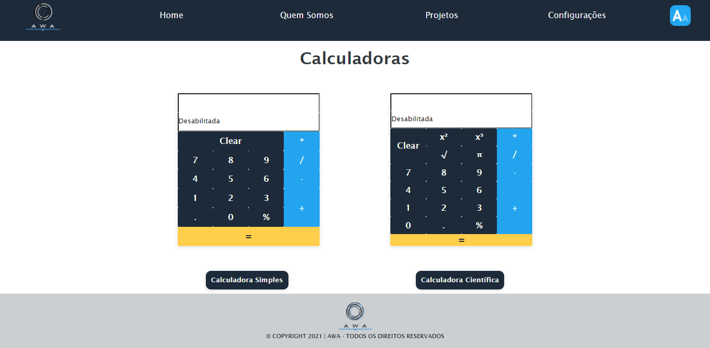

# Projeto-JavaScript
Projeto Final do Módulo de JavaScript da [SoulCode Academy](https://soulcodeacademy.org/). 

---
- **Tecnologias utilizadas:** HTML, CSS e JavaScritp.

---

- **Requisitos:**

Criar uma landing page que acesse outras 3 paginas cada uma com as funções pré definidas abaixo:
- [x] Botão de Acessibilidade Que Transforme as Letras Das Páginas Maiores Para Pessoas com Baixa Visão.
- [x] Botão Para Adicionar Novo Estilo a Página e Outro Para Voltar ao Original.
- [X] A Linkagem das Páginas Deverá Ser Feita Por Link Externo ou Menu.

---

- **Página Calculadora:**
- [x] Uma Calculadora Simples e Outra Científica.
- [x] A Científica Deverá Ter as Mesmas Funcionalidades da Simples Adicionando:
Raiz Quadrada , Elevado a 2 , Elevado a 3 e Numero Pi.
- [x] Enquanto Uma Estiver Ativa a Outra Deverá Estar Desabilitada (efeito deverá ser feito com botão).

---
- **Página de Cadastro:** 
- [x] Nome Completo (converter todas as letras para maiúscula).
- [x] Validar o CPF - Se Invalido, Chamar um Alert ou Deixar Campo Vermelho no Formulário.
- [x] Data de nascimento - Não Pode Ter Idade Negativa e Mais de 130 Anos, Se invalido Chamar um Alert ou Deixar Campo Vermelho no Formulário.
- [x] E-mail - Se Invalido, Chamar um Alert ou Deixar Campo Vermelho no Formulário.
- [X] Sexo (Masculino , Feminino e Não informado) via Seletor.
- [X] Exibir os Campos Dentro de Uma Div Com a Seguinte Frase "Ola (nome) , Seu Login É: (email) , Você Tem (idade) Se Define Como Uma Pessoa do Sexo(sexo) e Pode Usar (CPF) Como Senha"

---

 Projeto Desenvolvido em Grupo: Aruhan, Aline e Weele. 

